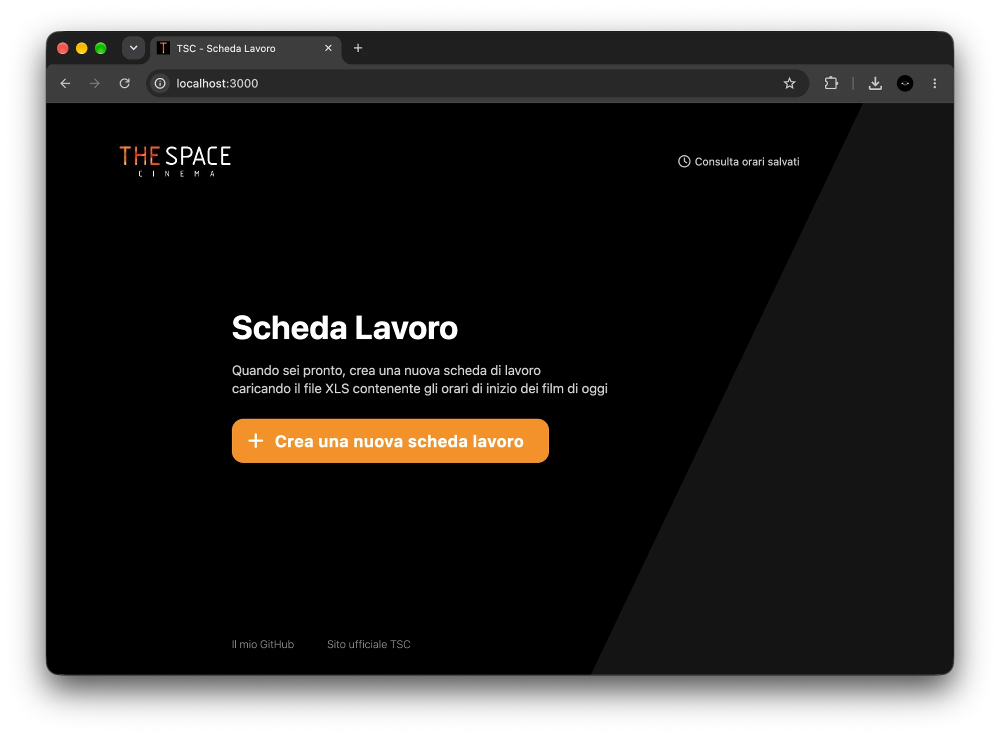
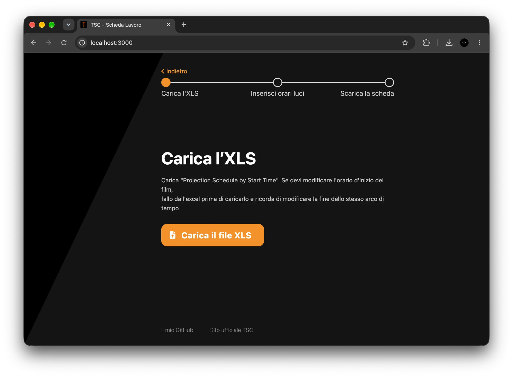
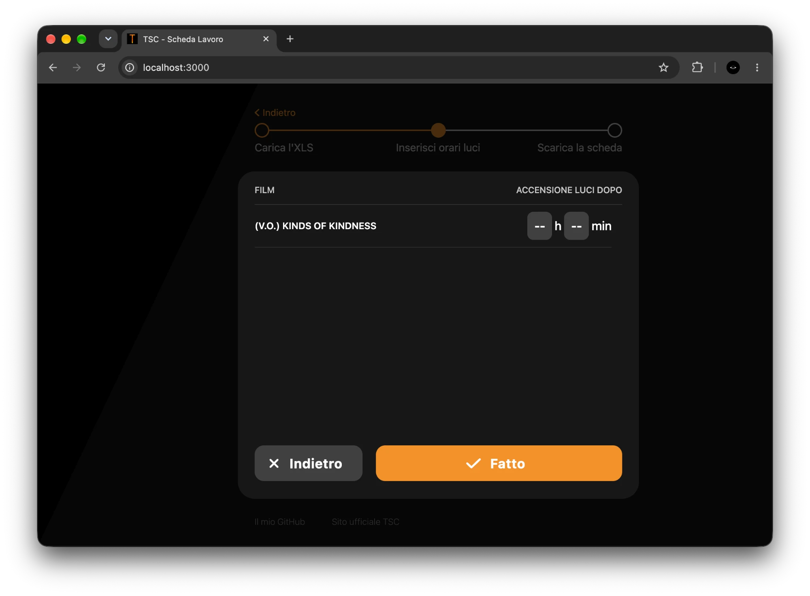
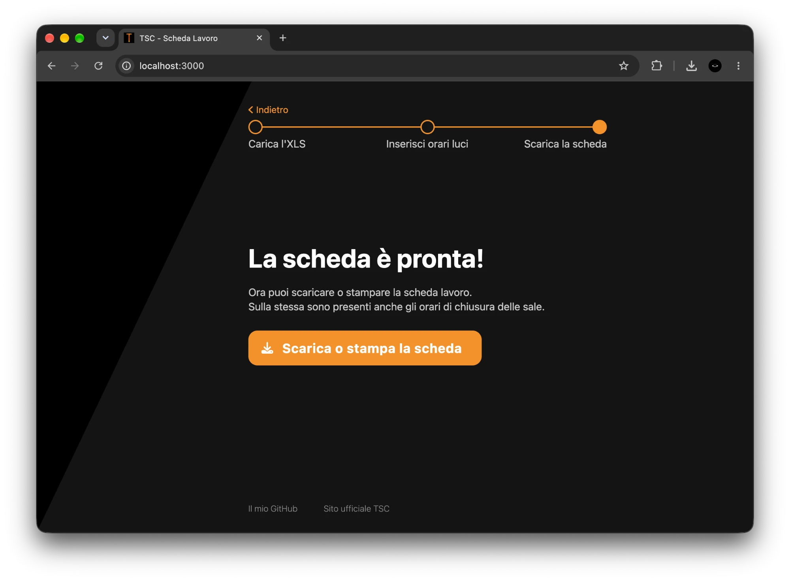
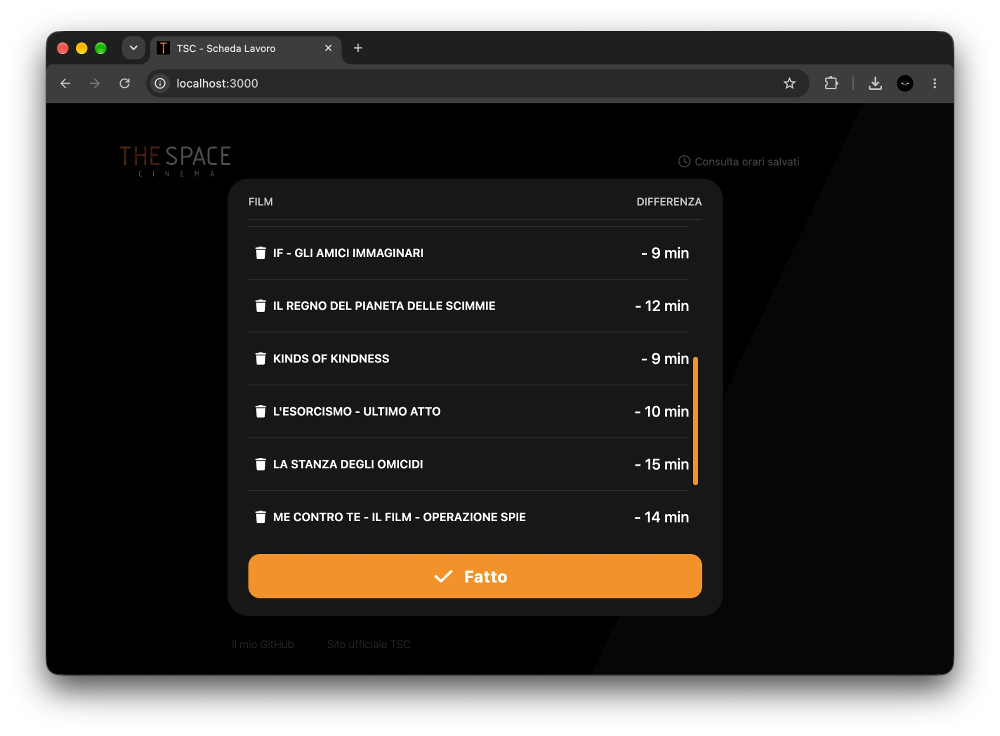
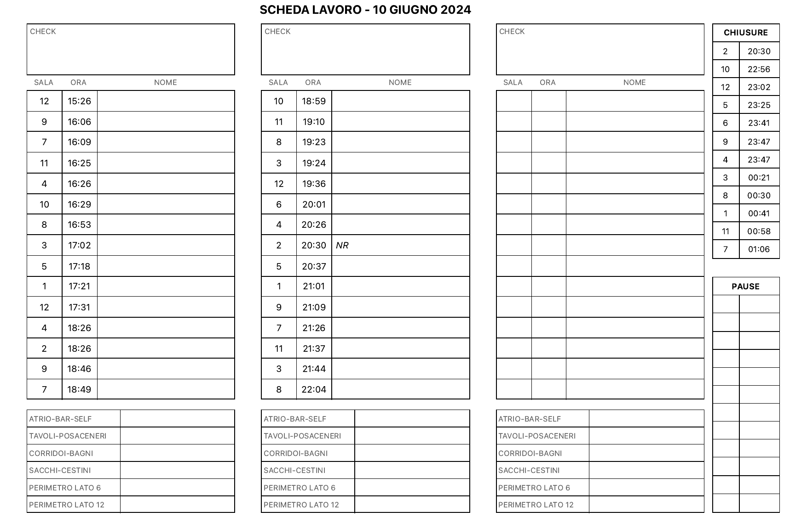
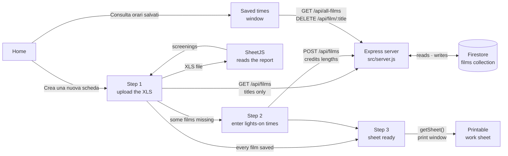

# TSC Work Sheet

A web app that turns The Space Cinema's daily screening schedule into a printable work sheet, with the time ushers must enter each screen.

[](LICENSE)




<!-- portfolio:summary
## The problem
At The Space Cinema in Silea, where I worked as an usher, audiences leave through exits under the screen. Ushers must enter before the credits, but the cinema's system only lists when screenings end, so staff worked out every entry time by hand.

## The solution
A web app: I upload the daily schedule exported from the cinema's system and get a printable work sheet with the time to enter each screen and when each screen closes. Each film's credits length is entered once and saved, so later sheets need no manual input.

## Technical challenges
- Choosing what to save: the credits length stays the same, while the ads before the film change every week.
- Reading the exported spreadsheet in the browser, where times come as text or as dates and screenings end after midnight.
- Building the sheet: sorting by entry time, marking each screen's last show and laying out three columns per A4 page.

## What I learned
- Talking to a client for the first time and finding what they need.
- Working with what I had: a few sample exports and what I knew from my shifts.
- Designing a technical tool that anyone on staff can use.

## Stack
Node.js, Express, Firebase Firestore, SheetJS, HTML, CSS, JavaScript
-->

<!-- portfolio:start -->
## The problem

In 2024 I worked as an usher at The Space Cinema in Silea, near Treviso. In most cinemas people leave a screen through the same doors they came in. In Silea they leave through doors under the screen, so the people coming out never cross the people walking into the next show: the flow goes one way only.

The catch is that, in the dark, the exit doors under the screen are hard to see. The entrance doors are better lit, so if nobody stops them, people walk back out the way they came in. That's the ushers' job: we had to be inside the screen before the end credits started, send people out through the exits under the screen, and then clean the empty room.

The Space's scheduling system (Vista) lists every screening with its end time, meaning the moment the projection is completely over, after the last credit. By then it's too late. The system was never designed for Silea's layout, so for years the staff worked out by hand, every day and one screening at a time, the time to go into each room. That's a lot of working hours spent on arithmetic.

## The solution

A web app in three steps, the same three shown in its progress bar:

1. **Upload the schedule.** I export the "Projection Schedule by Start Time" report from Vista as an XLS file and upload it. The app checks that it is the right report and reads the date, screen, start time, end time and title of every screening.
2. **Enter the missing credits (only for new films).** For every film the app looks up how long its end credits last. If a film isn't saved yet, it asks once how many hours and minutes after the start of the screening the lights come on. From that it saves the time between the start of the credits and the end of the screening. The next time that film appears in a schedule, nobody has to type anything.
3. **Print the sheet.** The app opens the browser's print preview with the sheet already filled in: one row per screening, sorted by the time to go into the room, with "NR" (*non riparte*, it doesn't restart) on a screen's last show, a box with the time each screen closes for the night, and empty columns for the staff to write their names and cleaning tasks. From there it can be printed or saved as a PDF.

Once the last show of the day has started, nobody else walks in, so people can leave through the front doors. Screens that empty after that are left off the main list and only appear in the closures box.



<!-- TODO: add docs/screenshots/lights-times.png (step two screenshot) -->




From the home screen, "Consulta orari salvati" lists every saved film with its credits length and lets me delete one. That's useful when someone typed a wrong time in step two.



I also wrote a three-page [user guide in Italian](docs/user-guide-it.pdf) for my colleagues.

## From input to output

The input is the Vista report for 10 June 2024. These are some of its rows (the report has 41 screenings across 12 screens):

| Sala | Start | Finish | Film Title |
| --- | --- | --- | --- |
| 7 | 14:00 | 16:18 | IF - GLI AMICI IMMAGINARI |
| 12 | 14:00 | 15:40 | ME CONTRO TE - IL FILM - OPERAZIONE SPIE |
| 9 | 14:00 | 16:17 | THE WATCHERS - LORO TI GUARDANO |
| … | … | … | … |
| 7 | 21:55 | 01:15 | KINDS OF KINDNESS |
| 8 | 22:30 | 00:40 | L'ESORCISMO - ULTIMO ATTO |

The saved credits length for *IF - Gli amici immaginari* is 9 minutes, so the 14:00 show in screen 7, which Vista says ends at 16:18, appears on the sheet as **7 – 16:09**. *Kinds of Kindness* has 9 minutes of credits too, and the 21:55 show is screen 7's last of the night, so screen 7 appears in the closures box at **01:06**. The last show to start is *L'Esorcismo* at 22:30, so screenings that empty from 22:30 on are not in the main list.



## Technical challenges

- **Choosing which interval to save.** The obvious choice was the time from the start of the screening to the start of the credits. But the start time in Vista includes the ads and trailers, and those change every week, so that number would have gone stale and the staff would have had to type it again. The credits at the end don't change. So I save the time between the start of the credits and the end of the screening, and every day I subtract it from Vista's end time. This was the choice that made the app worth using: enter a film once, never again.
- **Reading the Vista export.** The XLS is a report, not a table: it has a title, the cinema's address, a "From 10/06/2024 06:00 Until…" line and a footer. I read it in the browser with SheetJS. The app checks that the first cell is "Projection Schedule by Start Time", takes the date from the "From" line and keeps only the rows that start with a screen number. Times arrive as text, or as Excel dates when someone edited the cell by hand, so I handle both. Screenings end after midnight, so any end time up to 07:00 counts as the next day.
- **Building the sheet.** I sort the screenings by entry time and, for each one, look for a later screening in the same room. If there is none, it gets "NR" and goes into the closures box. The sheet is an HTML page generated in JavaScript and sized for an A4 landscape page, with three columns of 15 rows. If there are more than 45 rows, the template repeats on a new page. I open it in a new window and call the browser's print dialog, so I didn't need a PDF library.
- **Saving and listing films.** Each film is a Firestore document keyed by its title. When a schedule is uploaded, the server looks up all of its titles and marks the missing ones. The saved times window loads films 100 at a time and fetches more when you scroll to the bottom.

## What I learned

- **Talking to a client.** It was one of the first times I worked out requirements with the people who would use the tool. I offered to build it for free, and I still had to convince them. In many companies "we've always done it this way" is a strong argument, and change is scary.
- **Making do with what I had.** I had no access to Vista beyond its exported reports. After I explained the idea, the cinema's director gave me sample exports. Those, and what I knew from working the shifts myself, were all I had, so I built everything around that one report format.
- **Interfaces anyone can use.** The task is technical, but the interface had to work for any colleague: three steps with one button each, error messages that say which file to upload, and a short user guide.
- **Problem solving.** The key was asking the right question: which time interval stays the same from one week to the next? I used all of these skills in my later projects.

## Stack

- Node.js and Express (server, API, security headers with Helmet, rate limiting)
- Firebase Firestore through `firebase-admin` (saved credits lengths)
- SheetJS (`xlsx` 0.16.2 from cdnjs) to read the XLS in the browser
- HTML, CSS and JavaScript, with no frontend framework
<!-- portfolio:end -->

## Architecture



- **The calculation happens in the browser.** The XLS never leaves the user's computer. Only the film titles go to the server, and only the credits lengths come back. The server is a thin layer over Firestore.
- **One Firestore document per film.** The document ID is the title exactly as Vista writes it, and the document holds `endTimeDifference` (minutes of credits) and `lastUpdate`. Vista uses a different title for versions like "(V.O.)" or "(3D)", so each version gets its own value.
- **The browser prints the sheet.** `sheet.js` returns a full HTML page with its own CSS (`@page { size: landscape }`, sizes in `vw`/`vh`). The app writes it into a new window and calls `print()`, so printing on paper and saving as a PDF work the same way.
- **One page, four screens.** `src/views/homePage/homePage.js` returns the whole HTML. The home screen, the three steps and the two overlays are elements that `app.js` shows, hides and animates.

## Running locally

You need Node.js, a Firebase project with Firestore enabled, and a service account key for that project (Firebase console → Project settings → Service accounts → Generate new private key).

```bash
npm install
cp .env.example .env
```

Fill in `.env`:

- `FIREBASE_SERVICE_ACCOUNT`: the content of the service account JSON file on a single line, in single quotes.
- `URL`: the address the app is served from, **with the trailing slash** (`http://localhost:3000/`). The frontend builds its API calls from it.
- `NODE_ENV=development`: without it, every request is redirected to HTTPS.
- `PORT` (optional, default 3000).

Then start it from the repository root (that's where `.env` is read from):

```bash
npm start
```

Open http://localhost:3000. To try the full flow you need a "Projection Schedule by Start Time" XLS exported from Vista. The repository doesn't include one.

**Without a Firebase project.** With Java installed, you can use the Firestore emulator instead: `firebase-admin` connects to it when `FIRESTORE_EMULATOR_HOST` is set. The service account JSON is still parsed at startup, so it needs the right shape (`project_id`, `client_email`, `private_key`), but no real credentials:

```bash
npx firebase-tools emulators:start --only firestore --project demo-tsc
# in another terminal, with FIREBASE_SERVICE_ACCOUNT pointing to project "demo-tsc"
FIRESTORE_EMULATOR_HOST=127.0.0.1:8080 npm start
```

There are no automated tests.

## Repository structure

```
tsc-scheda-orari/
├── src/
│   ├── server.js                ← Express app: security middleware, static files, API routes for the films
│   ├── middleware/              ← HTTPS redirect and trailing-slash redirect
│   ├── services/firebase.js     ← Firestore connection from FIREBASE_SERVICE_ACCOUNT
│   ├── views/homePage/          ← the HTML of the single page: home, three steps, two overlays
│   └── static/homePage/
│       ├── app.js               ← XLS parsing, entry-time calculation, API calls, screen transitions
│       ├── sheet.js             ← generates the printable work sheet as an HTML page
│       ├── style.css            ← layout and animations
│       ├── icons/               ← SVG icons for the buttons
│       └── imgs/                ← The Space Cinema logo and favicon
├── docs/
│   ├── screenshots/             ← images used in this README
│   └── user-guide-it.pdf        ← the guide I wrote for my colleagues, in Italian
├── .env.example                 ← environment variables with placeholder values
├── package.json
├── README.md
├── LICENSE
└── portfolio.yml                ← metadata for my portfolio
```

## Known limitations and future work

I wrote this quickly, for one cinema, and the code shows it. These are the problems I know about:

- **No login.** Anyone with the URL can read and delete the saved times. That was acceptable because the data isn't sensitive, but a wrong click can still wipe a value.
- **Incomplete error handling on the server.** Saving a film answers "OK" before Firestore has confirmed the write, so a failed save goes unnoticed. Deleting a film can try to answer twice when Firestore returns an error.
- **The film title is the document ID.** A title containing `/` can't be saved: the server answers "OK" and nothing is stored, and the next lookup fails with an error 500.
- **Saved times can't be edited**, only deleted and entered again on the next upload.
- **The sheet is tied to Silea.** The closures box has 12 rows, one per screen in Silea: a 13th screen would overwrite the "Pause" box. The "Pause" box itself is never filled in, and the cleaning tasks ("PERIMETRO LATO 6", "PERIMETRO LATO 12") are written into the template.
- **Leftover code.** Socket.IO is started but never used, and so are `cookie-parser` and the Firebase storage bucket. An "event list" feature is commented out. The page opens `<html>` before `<!DOCTYPE html>`, so browsers render it in quirks mode.
- **It only reads one report format,** the Vista "Projection Schedule by Start Time" export, and the interface is in Italian only.

If I picked it up again:

- **Move the calculation into a separate module with tests.** Reading the report, computing entry times and finding closures are pure functions today, mixed in with DOM code in `app.js`. On their own, I could test them against the 10 June 2024 export, checking that the result matches the printed sheet row by row.
- **Fix the server's responses.** I would wait for every Firestore write and delete before answering, send exactly one response, and show errors in the interface. Films would get automatic document IDs, with the title stored in a field, so any title works. I would also add an endpoint to edit a saved time instead of deleting it.
- **Add a shared staff password** in front of the delete route, which is enough for a tool used by one team.
- **Move the sheet's layout to a configuration file** (screens, cleaning tasks, number of rows). Other cinemas with exits under the screen could then use it without touching the code.
- **Remove the unused dependencies** and fix the doctype.

## Credits and license

- Idea, code, interface and user guide: Tommaso Moro.
- The cinema's director provided the sample Vista exports I used to build and test the app.
- [SheetJS](https://sheetjs.com/) (`xlsx` 0.16.2, loaded from cdnjs) reads the XLS files.
- The Space Cinema name, logo and favicon (`src/static/homePage/imgs/`) belong to The Space Cinema. They are not covered by the MIT License.

The code is released under the [MIT License](LICENSE).

---

Created by Tommaso Moro in July 2024.
